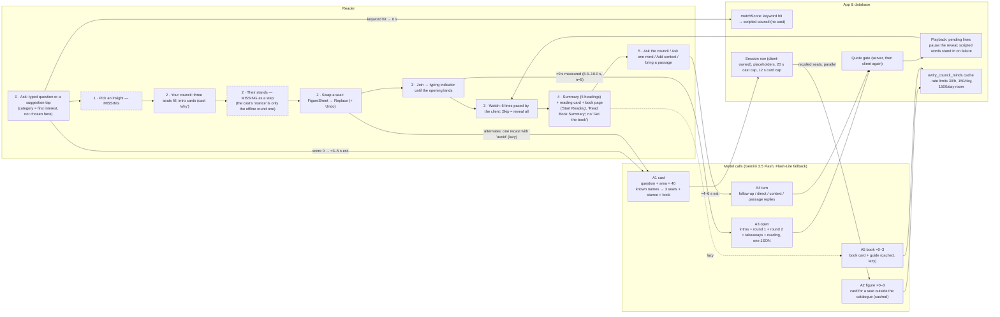

# Council orchestration review — A (deployed `council-chat`) vs B (the harness) → recommendation

*Written 6 October 2026. Review only: nothing in either branch was changed; this file is the only write.*

**Labels, as instructed.** **A** is what is on `main` and deployed: the `council-chat` edge function plus the Council
client under `src/council/`. **B** is the branch `claude/owlry-council-setup-test-u2n0i8`: the Council harness that was
run inside Claude Code sessions (prompts and orchestration in `owlry-council/`), together with the edge function it
proposes but never deployed. The brief's own wording ("A = demonstrated in the session, B = deployed") is the other
way round; the evidence below is organised by what each thing *is*, so nothing is lost either way.

**Step numbering.** The step diagram you sent is the reference: **0 Ask** (category + question) → **1 Pick an
insight** → **2 Your council · Their stands · Swap a seat** → **3 Join / Watch the debate** → **4 Summary + books** →
**5 Ask the council / Ask one mind**. The brief's seven headings map onto it as: brief 0 → step 0–1, brief 1 → step 2
(council + stands), brief 2 → step 2 (swap), brief 3 → step 3, brief 4 → step 4, brief 5 (book card) → step 4, brief 6
(continue) → step 5. Call IDs in the diagrams (A1…, B1…, H1…) link to the call tables.

**Headline.** Neither A nor B is the MVP as it stands. A has the right *skeleton* (one structured call per phase, the
quote rule enforced in code, a cached catalogue, a client that never goes dark, a live backend with measured ≈9 s
openings) but no insight step, no stands, no safety routing and a debate shape (two rounds) that has no explicit moves.
B has the right *casting and debate discipline* (fit-then-contrast casting, denylist + screen, a position ledger with
hold/shift/concede, a five-section summary that matches the brief line for line) but spends 13–15 model calls and 30–45
s of serial generation per session, forbids quotations outright, and was never deployed. The recommendation (section
5) is a **hybrid on A's skeleton**: three calls for a fresh session (usher → caster → debate-and-summary), B's casting
and ledger ideas moved into those calls' output schemas, and the rest done in code. It is also the design closest to
your diagram, with two deliberate departures (no separate "screen" model call; the swap seat comes from a background
recast, not a swap call).

---

## 1. Evidence inventory

### 1.1 A — `main` @ `d101856` ("Ship Owlry at / and the Council Room at /council/ from main")

| Item | Where | Notes |
| --- | --- | --- |
| Edge function (entry point, 5 modes, model settings) | `supabase/functions/council-chat/index.ts` (385 lines); modes at lines 14–21, `open` 177–218, `turn` 220–246, `cast` 249–262, `figure` 270–284, `book` 286–300; rate limits 350–359 | `MODEL_VOICE = 'gemini-3.5-flash'`, `MODEL_FAST = 'gemini-3.1-flash-lite'` (`_shared/gemini.ts:24–26`); `thinkingLevel: 'LOW'` on every call; `open` temperature 0.9 / 4 000 max output tokens; `turn` 0.9 / 2 000; `cast` 0.6 / 1 500; recall modes 0.3. Flash-Lite fallback on 404/408/429/5xx/bad JSON only, never on a safety block (`gemini.ts:103–125`). |
| Prompts | `supabase/functions/_shared/council/prompts.ts` — `COUNCIL_SYSTEM` 25–57 (2 353 chars), `openUser` 77–97, `turnUser` 99–144, `KNOWLEDGE_SYSTEM` 158–191 (2 966 chars), `castUser` 210–243, `figureUser` 251–282, `bookUser` 289–319 | Written against the Gemini JSON-schema path (`responseJsonSchema`, `gemini.ts:66–79`). |
| Quote gate | `_shared/council/quotes.ts` (server) and `src/council/lib/councilClient.ts:72–105` (client, again) | A `"quote"` segment survives only if it matches a dossier quote after normalisation; recalled quotes come back `attributed: true`. |
| Schemas | `_shared/council/schemas.ts` — `OPEN_SCHEMA` 83–128 (intros ×3, round1 ×3, round2 ×3, takeaways, reading), `TURN_SCHEMA` 130–137 | Property order is generation order ("`known` above all", 139–146). |
| Client orchestration | `src/council/store/useStore.ts` — `requestOpening` 192–210 (marks r1/r2 `pending`, overlays live words), `requestTurn` 212–232, `castCouncil` 343–368 (cast capped at 20 s, cards at 12 s: `CARD_WAIT_MS` 251, `CAST_WAIT_MS` 253), `ask` 399–414 (`area = interests[0] ?? 'other'`, line 404; live cast only when `matchScore(...).score === 0`, line 402), `revealAll` 434, `sendFollowUp` 441, `replaceSeat` 458–485, `ensureAlternates` 586–608 | Line numbers are for `d101856`. The working tree of `/Users/polar/owlry` is being edited by another session (34 files differ, including these three); everything here was checked against the committed revision. |
| Engine (scripted fallback, swap, follow-ups, pacing) | `src/council/engine/council.ts` @ `d101856` — `castScript` 67–95 (round one = the cast's `stance`, line 78), `candidatesFor` 98, `followUp` 244–257 (slot `f1`/`f2`/`generic`, line 253), `addContext` 260, `replaceSeat` 290–328, `typingDelay` 446 (500 ms + 3 ms/char, ≤1.5 s), `readingPause` 453 (≤0.9 s) | Playback pauses on a message whose live words are still pending (`DiscussionScreen.tsx:66` @ `d101856`; `useStore.ts:429`). |
| Screens | `CouncilScreen.tsx` (ask box + suggestions, no category picker; the "Seating the council…" state, 125–129), `DiscussionScreen.tsx` @ `d101856` (skip pill 256–263 → `revealAll`; composer targets "Everyone / <seat> / Add context" 269–283; seat chip → `FigureSheet` with "Ask" and "Replace" 86–92 of `FigureSheet.tsx`), `SummaryScreen.tsx` (the five headings, i18n `summary.agree/differ/fits/next/books`, `ui.ts:164–168`), `BookScreen.tsx` ("Start Reading", "Read Book Summary", save; no outbound purchase link) | There is no "Get the book" string or link at `d101856` (`git grep -i getBook d101856 -- src/council` → nothing). The uncommitted working tree (another session, 6 Oct) adds `book.getBook` to `ui.ts` and a "Get the book" link in `BookScreen.tsx` to `https://openlibrary.org/isbn/<isbn>` — curated books only (recalled books have no ISBN), not an affiliate link. |
| Catalogue | `src/council/content/figures.ts` — **43 figures** (count of `id:` entries), 51 verified quotes (avg 87 chars, every one with a `loc`, 14 with a URL), avg bio 203 chars; `books-1.ts` + `books-2.ts` — **45 books**, 43 with ISBN; `councils/index.ts` — 8 scripted councils, 6 areas, 24 primary seats + 24 alternates | The brief's phrase "pipeline-v2 catalog of 43 minds" does not occur in either repo; the **43** is verified, "pipeline-v2" is not a term the code uses. |
| Deployment — CI | `gh run list`: "Deploy app.owlry.ai to GitHub Pages" and "Deploy Supabase backend" both `success` on `main` @ `d101856` at 2026-10-06T09:44:13Z | `.github/workflows/deploy.yml:15` deploys from `main`; lines 81–86 fail the build if Owlry links to `/council` (the Council stays unlisted). `owl-chat-deploy.yml:31–44` deploys the functions and the two council migrations. |
| Deployment — Supabase (project `twxzbpfchoctxyjeivvr`, "Owlry Landing Page", ACTIVE_HEALTHY) | `list_edge_functions`: `council-chat` v2, `verify_jwt: true`, updated 2026-10-06T09:42:54Z; `get_edge_function` returned the deployed bundle and **all eight files are byte-identical to the working tree** (`council-chat/index.ts`, `_shared/gemini.ts`, `cors.ts`, `lang.ts`, `council/schemas.ts`, `quotes.ts`, `prompts.ts`, `minds.ts`) | There is **no** function named `council` (B's) in the project. `https://app.owlry.ai/council/` answers HTTP 200. |
| Production measurements | Supabase `function_edge_logs`, 2026-10-03: five `POST 200` calls to `council-chat` at 13:06–13:26 UTC with execution times **8 740 / 9 080 / 8 341 / 9 955 / 9 214 ms** (mean 9 066 ms); two 401s and one 400 earlier that day; 2026-10-06: two 400s (05:17, 09:43 — the second coincides with the deploy). No calls on 4–5 Oct. | The log does not record the `mode`; the DB shows four sessions with `source = 'live'` (two `literature`, two `relationships`, all 2026-10-03), so these are almost certainly `open` calls. `owlry_council_sessions` holds 22 rows; `owlry_council_minds` holds **0 rows** — no thinker or book has ever been recalled in production, so the cast → figure → book path has not been exercised live. |
| Docs | `docs/council-backend.md` (§"Minds from the model", "Where the backend stands"), `docs/council-orchestration.md` (§10 "As built, 2 October 2026"), `docs/council-prompts.md`, `src/council/AGENTS.md` | |

### 1.2 B — `claude/owlry-council-setup-test-u2n0i8` @ `b3502a0` (worktree `.claude/worktrees/owlry-council-setup-test/owlry-council/`)

| Item | Where | Notes |
| --- | --- | --- |
| The session | Five commits authored "Claude <noreply@anthropic.com>" on 2026-09-22, 09-23 and 10-02, on top of `renovation/homescreen` (`2ed0224`); branch name pattern `claude/…-u2n0i8` = a Claude Code session branch | The runs' `.state.json` files record 29 subagent ids (e.g. `a610ad0a7cb1ad337`) and per-call wall seconds. **Gap:** none of those subagent transcripts exist under `~/.claude/projects` on this machine (searched by id), so the only session artefacts are the committed run files and state. |
| Executed orchestration | `HARNESS.md`; `.claude/commands/council.md` (the `/council` flow); `.claude/agents/council-{caster,screen,forge,mind,summarizer}.md` (generated from `prompts.ts` by `scripts/build_agents.ts`, models `sonnet`/`haiku` by Claude Code alias — **the exact model id behind the alias on those dates is not recorded**); `scripts/live.ts` (builds every task from `prompts.ts`, records replies and wall time, checks "prompt fidelity") | Runs 4–6 say "Prompt fidelity: 14/14 (15/15) subagents received exactly the prompt built from prompts.ts". |
| Prompts | `supabase/functions/council/prompts.ts` — `BENCHES` 7–41, `CAST_SYSTEM` 52–72 (2 243 chars), `SCREEN_SYSTEM` 77–80, `forgeSystem` 85–100, `SHARED_RULES` 107–123 (2 111 chars, includes the hidden `POSITION … | MOVE … | OPEN …` tail), `identityBlock` 125–129, `mindSystem` 131–146, `directorNote` 181–217 (cycles `positions` ≤80 words / `pressure` ≤60 / `application` ≤60 / `reply` ≤70), `SUMMARY_SYSTEM` 222–232, `ROUTE_SYSTEM` 258–260 | `identityBlock`: "Never present any sentence as a verbatim quotation" — B has **no** quotation path at all. |
| Proposed server (never deployed) | `supabase/functions/council/index.ts` — config 51–61 (`claude-sonnet-5`, `claude-haiku-4-5-20251001`, 9 turns, mind turns `effort: low`, `thinking: disabled`, system prompt cached), SSE 74–111, tail parsing 116–150, books via Gutendex/Google Books 180–232, `forgeMind` 241–275, `castCouncil` 280–309, `screenNames` 312–327 (denylist table + Haiku), `speak` 332–420 (streamed turn, tail withheld), `startCouncil` 425–530 (cast → screen → session row + `cast` event → forge in parallel → prewarm → 9 serial turns → summary), `replyCouncil` 574–671 (name match, else a Haiku route; ≤2 turns; "quiet-table rule"); `model.ts` (fetch adapter, prompt caching, `prewarm`); `migrations/20260921000000_council.sql` (`council_minds`, `council_denylist`, `council_sessions`, `council_turns` with `usage` + `latency_ms`, `council_summaries`; RLS lets the client update only `skipped_at_turn`) | `model.ts:67–69` sends `thinking: {type: "disabled"}` to any `claude-sonnet-5*` model — accepted by Sonnet 5, **rejected (400) by Sonnet 5.5**, so the server as written cannot be pointed at the current Sonnet without a change. |
| Proposed client | `src/council/councilStore.ts` — reveal dwell 150 ms/word, 1.2–7 s (`WORD_MS`, `MIN_DWELL`, `MAX_DWELL` 87–89); `skip` reveals everything already received and reports the turn index (268–273); `reply` forces a skip (260); `CouncilRoom.tsx` unstyled | |
| Runs (the executed behaviour) | `council/runs/` — six runs: `20260922-1059` (career, PMF), `20260922-1110` (health, doomscrolling), `20260922-1121` (relationships, money fight), `20260922-pmf-gtm-ai-consumer` (manual mode), `20260923-0818` (other, perseverance), `20261002-0740` (other, brain fog), each with a `.state.json`; `index.html` | Per run: 1 cast + 1 screen + 0–3 forges + 9 turns + 1 summary = **12–15 calls**. Moves: 2–3 `shift`/`concede` per run, always in cycle 2 (turns 4–6), never in cycle 3. Word caps exceeded in 5 of 6 runs (e.g. 124 words at a cap of 80). Summariser wrapped JSON in code fences in every run and returned `differ` as a string in four; one forge reply was not valid JSON ("Production would fail the session here", run 5). |
| Latency and cost claims | `README.md:82–95` (estimates: card ≈3–4 s, first bubble ≈5 s warm / 15–25 s cold, summary ≈30 s warm / 45 s cold), `README.md:153–158` ("≈ $0.04–0.06 per session", "a forge ≈ $0.02") | All **estimates**; the runs' wall times (e.g. summary 108 s, cast 64.7 s) are Claude Code subagent overhead and the harness itself says they "do not reflect production latency". |

### 1.3 Cross-cutting evidence

- **Scout's crisis behaviour** (reusable): `supabase/functions/_shared/schemas.ts:30` — the Scout call already classifies `note_domain ∈ {finance, medical, legal, crisis, addiction, grief} | null` in the same model call; `_shared/prompts/scout.ts:88–94` — "NO AVOIDANCE … crisis -> still recommend the book AND add 'and please — reach out to someone you trust or a professional…' (never name methods of self-harm)". Scout **never bypasses**; it appends a one-sentence note. The Council's `COUNCIL_SYSTEM` rule 6 (`prompts.ts:46–48`) does the same inside the council. Neither branch has a support page or a route around the council.
- **Eligibility.** A: prompt only (`castUser`: "philosophers, scientists, writers, founders, practitioners"; `KNOWLEDGE_SYSTEM` rule 5: living people by published work only; recall answers `known:false` for a name the model does not recognise → 404 → the client keeps what it has). No denylist, no "sitting politician" rule anywhere in A. B: `CAST_SYSTEM` hard rules (hate/extremism/crime, sitting politicians, private individuals, fictional characters), `council_denylist` checked in code, then a Haiku screen; one recast on rejection, then fail. In six runs the screen rejected nobody.
- **Pricing sources (first-party).** Gemini Developer API pricing page — Gemini 3.5 Flash $1.50 / $9.00 per 1M input / output tokens (cached input $0.15), Gemini 3.1 Flash-Lite $0.25 / $1.50: <https://ai.google.dev/gemini-api/docs/pricing>. Claude — Sonnet 5.5 $2 / $10, Sonnet 5 $2 / $10, Haiku 4.5 $1 / $5, cache reads ≈ 0.1× input (Opus 5.5 $4 / $20 for reference): the `claude-api` skill's pricing table, cached 2026-09-25, which points at <https://platform.claude.com/docs/en/about-claude/pricing>. Gemini bills thinking tokens as output.
- **Speed sources (third-party, treat as rough).** Artificial Analysis lists Gemini 3.5 Flash at ≈ 213 tokens/s (first-party API, "high" reasoning setting; its 16.5 s time-to-first-token is dominated by that reasoning setting and does not apply to A's `LOW`): <https://artificialanalysis.ai/models/gemini-3-5-flash/providers>. Claude Sonnet 5.5 at ≈ 89–140 tokens/s and ≈ 0.9–3 s to first token across aggregators (<https://artificialanalysis.ai/models/claude-sonnet-5-5/providers>, <https://computeprices.com/models/claude-sonnet-5-5>). Every latency figure below that is not marked *measured* is an estimate from these rates plus ≈1 s of overhead per call.

---

## 2. Three diagrams

Lanes: **Reader** (what they see and tap) · **Model calls** (one node per call, with its ID) · **App & database** (code, cache, tables). Dashed nodes are steps the design does not have. Edge labels carry the reader's wait.

### 2.1 A — deployed `council-chat` + the `src/council/` client (`main` @ `d101856`)

### 2.2 B — the harness as run, and the server it proposes (`b3502a0`)

```mermaid
flowchart LR
  subgraph R["Reader"]
    direction TB
    R0["0 · Ask: question + category + optional 'situation'"]
    R1["1 · Pick an insight — MISSING<br/>(the caster names one 'tension' itself)"]
    R2["2 · Council card: name · why · lens · book (+ read free / buy)"]
    R2s["2 · Their stands — folded into cycle 1 (turns 1–3)"]
    R2w["2 · Swap a seat — MISSING (no replace path)"]
    R3["3 · Bubbles stream one at a time, dwell 150 ms/word"]
    R3w["3 · Skip to the summary: reveals what has arrived;<br/>the rest still has to be generated"]
    R4["4 · Five-section summary, books with verified links"]
    R5["5 · Reply: 1–2 minds answer; no 1:1 thread, no new stands"]
    R0 --> R1 --> R2 --> R2s --> R2w --> R3 --> R3w --> R4 --> R5
  end
  subgraph M["Model calls (Sonnet 5 + Haiku 4.5 as proposed; Claude Code 'sonnet'/'haiku' as run)"]
    direction TB
    B1["B1 cast (Sonnet)<br/>question + situation + bench → kind, tension, 3 seats, opening seat"]
    B2["B2 screen (Haiku)<br/>3 names → ok / reject"]
    B3["B3 forge ×0–3 (Sonnet, parallel)<br/>persona card, cached forever"]
    B4["B4 mind turn ×9 (Sonnet, serial, streamed)<br/>system = identity + rules + card (cached); user = director's note"]
    B5["B5 summary (Haiku)<br/>transcript + tails → 5 sections + books"]
    B6["B6 route (Haiku, only if no name in the reply)"]
    B7["B7 reply turn ×1–2 (Sonnet)"]
  end
  subgraph D["App & database"]
    direction TB
    D1["council_denylist check (code) before the screen"]
    D2["council_minds cache · Gutendex / Google Books verify titles + links"]
    D3["Hidden POSITION | MOVE | OPEN tail parsed, stored on council_turns"]
    D4["Links attached from cards in code, never from the model"]
    D5["Client paces the reveal; skipped_at_turn written by the client"]
  end
  R0 -- "≈3–4 s est." --> B1 --> D1 --> B2
  B2 -- "card shown before forging" --> R2
  B2 -- "cold: +10–20 s est." --> B3 --> D2
  B3 --> B4
  B2 -- "warm: first words ≈5 s est." --> B4
  B4 -- "each turn ≈2.5–4 s est., ×9 serial" --> D3 --> D5 --> R3
  B4 --> B5 --> D4 --> R4
  R5 --> B6 --> B7 --> D3
  style R1 stroke-dasharray: 6 4
  style R2w stroke-dasharray: 6 4
```

### 2.3 H — the recommendation (hybrid on A's skeleton)

```mermaid
flowchart LR
  subgraph R["Reader"]
    direction TB
    R0["0 · Ask: category tile → question → Ask"]
    R0c["Crisis → support page, no council"]
    R1["1 · Pick an insight: one friendly line + 3 tensions (≤12 words) + Other; multi-select"]
    R2["2 · Your council: 3 names, why, book — and their stands, same card"]
    R2w["2 · Swap a seat (before Join): instant, from the prefetched alternate"]
    R3["3 · Join → first line ≈2–3 s streamed (≈10 s unstreamed); cast locks"]
    R3w["3 · Watch 7–9 lines, mark a line, or Skip"]
    R4["4 · Summary (5 sections) + 3 books; book card: why · start · Read summary · Get the book"]
    R5["5 · Ask the council (new stands + short debate + refreshed summary) / Ask one mind (1:1)"]
    R0 --> R0c
    R0 --> R1 --> R2 --> R2w --> R3 --> R3w --> R4 --> R5
  end
  subgraph M["Model calls (Gemini 3.5 Flash voice, Flash-Lite usher; adapter keeps Claude as an A/B)"]
    direction TB
    H1["H1 usher (Flash-Lite, ~1–2 s)<br/>category + question → kind, 3 tensions, safety flag"]
    H2["H2 caster (Flash, ~3–5 s)<br/>+ selected tensions + custom text + known names + avoid<br/>→ 3 seats: lens, why, book, stance (the stands)"]
    H2b["H2' caster again, background<br/>avoid = the three seats → alternates (for Swap)"]
    H3["H3 debate + summary (Flash, one call, JSON lines)<br/>7–9 lines with seat, replies_to, move, segments; then the 5 sections + reading"]
    H4["H4 host (Flash, 1 call per message)<br/>council follow-up = stands + 3–6 lines + summary delta; 1:1 = one seat"]
    H5["H5 figure / book recall ×0–3 (cached, lazy; A's modes unchanged)"]
  end
  subgraph D["App & database"]
    direction TB
    D0["Code safety screen (keyword list) + usher flag → route"]
    D1["Denylist table + 'sitting politician' rule; recall known:false → seat dropped and recast"]
    D2["Per-line checks: seat order, replies_to exists, move set, ≤70 words, quote gate; near-duplicate lines rejected once"]
    D3["Paced reveal; Skip = jump to what has arrived, wait only for the stream tail"]
    D4["Books fixed by the cast; links from ISBN/Gutendex in code; summary books never from the model"]
    D5["Session row: question, category, tensions[], custom text, seats, lines, summary, marks"]
  end
  R0 -- "≈1–2 s" --> H1 --> D0
  D0 --> R1
  R1 -- "≈3–5 s" --> H2 --> D1 --> R2
  H2 -.-> H2b
  H2b -.-> R2w
  R3 --> H3 --> D2 --> D3 --> R3w
  H3 --> D4 --> R4
  R5 -- "≈4–8 s" --> H4 --> D2
  R2 -. "lazy" .-> H5
  D5 --- R4
```

### 2.4 Call tables

**A — per fresh session.** Token counts are estimates at ≈4 characters per token from the measured prompt sizes; "n" is invocations per session.

| ID | Model | Inputs (size) | Outputs (size) | n | Latency | Cost / call |
| --- | --- | --- | --- | --- | --- | --- |
| A1 `cast` | gemini-3.5-flash, temp 0.6, LOW thinking, 1 500 max out | `KNOWLEDGE_SYSTEM` 2 966 chars + `castUser` 2 062 chars + ≤40 known names ≈ 5 600 chars ≈ **1.4k tokens** | 3 seats (name, short, label, role, why, stance, book) ≈ 0.5k tokens (+ thinking, unknown) | 0 (keyword hit) or 1 | **est.** 3–5 s | est. $0.007 |
| A2 `figure` | same model, temp 0.3, 3 000 max out, no fallback | ≈ 3.5k chars ≈ 0.9k tokens | card ≈ 1.2k tokens | 0–3, then cached for everyone | est. 6–10 s (parallel, capped at 12 s) | est. $0.012 |
| A3 `open` | gemini-3.5-flash, temp 0.9, LOW, 4 000 max out | `COUNCIL_SYSTEM` 2 353 + frame 1 063 + 3 dossiers (curated ≈ 600 chars each; recalled up to ≈ 2 500 by the size caps) ≈ 5 200–9 000 chars ≈ **1.3–2.2k tokens** | 3 intros + 6 lines + 4 takeaways + 3 reading reasons ≈ 1.0–1.3k tokens (+ thinking) | 1 | **measured 8.3–10.0 s** (n=5, 3 Oct) | est. $0.015–0.02 |
| A4 `turn` | gemini-3.5-flash, temp 0.9, LOW, 2 000 max out | system + frame + dossiers + ≤12 history lines ≈ 6–9k chars ≈ **1.5–2.3k tokens** | 1–3 lines ≈ 0.15–0.4k tokens | per reader message | est. 4–6 s | est. $0.005 |
| A5 `book` | recall model, temp 0.3, 4 000 max out | ≈ 1.1k tokens | card + 3–6 guide paragraphs ≈ 1.5k tokens | 0–3, cached | est. 8–12 s, lazy | est. $0.015 |

Per session, warm (curated seats or cached cards): **1 call, ≈1.5k tokens in, ≈1.2k out, ≈ $0.02**; uncatalogued question: **2 calls** before the room fills (+ 0–3 recalls, each paid once ever). Unknowns: Gemini's LOW-thinking token count is not logged anywhere (A does not store `usage`).

**B — per fresh session (as proposed in `index.ts`; the harness ran the same prompts through Claude Code).**

| ID | Model | Inputs (size) | Outputs (size) | n | Latency | Cost / call |
| --- | --- | --- | --- | --- | --- | --- |
| B1 cast | claude-sonnet-5, effort low, 1 200 max out | `CAST_SYSTEM` 2 243 chars + JSON (question, situation, bench ≈ 20 names, exclude, recent) ≈ 3k chars ≈ **0.75k tokens** | kind, tension, 3 seats, opening seat ≈ 0.4k tokens | 1 (2 if the screen rejects) | est. 3–4 s | est. $0.006 |
| B2 screen | claude-haiku-4-5, temp 0 | 574 chars + names ≈ 0.2k tokens | verdicts ≈ 0.06k | 1 (2 on recast) | est. ≈1 s | ≈ $0.0005 |
| B3 forge | sonnet, effort medium, 4 000 max out | ≈ 1.1k chars ≈ 0.3k tokens | card ≈ 1k tokens; books verified via Gutendex / Google Books in parallel | 0–3, cached forever | est. 10–20 s, parallel (README) | est. $0.011 |
| B4 mind turn | sonnet, effort low, thinking disabled, 500 max out, system cached | system = identity ≈ 450 + rules 2 111 + card JSON ≈ 3 700 chars ≈ **1.6k tokens (cached after first use per mind)**; director's note grows **≈ 250 → 1 100 tokens** over the nine turns (measured from the run transcripts: 0 → 3 150–3 450 chars of transcript before turn 9) | ≤ 80 / 60 words + tail ≈ 0.13k tokens | **9, serial** | est. 2.5–4 s each (TTFT ≈1 s + ≈130 tokens at 90–140 t/s) | est. $0.003–0.004 |
| B5 summary | haiku, temp 0.2, 900 max out | `SUMMARY_SYSTEM` 1 201 chars + JSON transcript + tails ≈ 6.5k chars ≈ **1.6k tokens** | 5 sections ≈ 0.4k | 1 | est. 3–5 s | ≈ $0.004 |
| B6 route | haiku, temp 0 | ≈ 0.2k | ≈ 0.03k | per reply without a name | ≈ 1 s | ≈ $0.0003 |
| B7 reply turn | as B4 | as B4 (note ≈ 1.2k tokens) | ≤ 70 words | 1–2 per reply | 2.5–4 s each | ≈ $0.004 |

Per session, warm: **12 calls** (1 + 1 + 9 + 1), ≈ 22k input tokens of which ≈ 9.5k are cache reads, ≈ 1.6k output, **≈ $0.045–0.05** (at Sonnet 5.5 / Haiku 4.5 prices; the README's $0.04–0.06 agrees). Cold: + $0.011 per forged mind and +10–20 s before the first bubble. Unknowns: which Sonnet the `sonnet` alias resolved to on 22–23 Sep and 2 Oct; no usage counters were captured by the harness.

**H — per fresh session (recommendation; all estimates).**

| ID | Model | Inputs | Outputs | n | Latency | Cost / call |
| --- | --- | --- | --- | --- | --- | --- |
| H1 usher | gemini-3.1-flash-lite, LOW, ≈ 400 max out | short system (≈ 1.5k chars) + category + question ≈ **0.5k tokens** | kind, 3 tensions ≤ 12 words, safety flag, "new topic" (for step 5) ≈ 0.1k | 1 | 1–2 s | ≈ $0.0003 |
| H2 caster | gemini-3.5-flash, temp 0.6, LOW | A1's prompt + selected tensions + custom text ≈ **1.5k tokens** | 3 seats incl. `stance` (the stands) + tension ≈ 0.6k | 1 (+1 background for alternates) | 3–5 s | ≈ $0.008 |
| H3 debate + summary | gemini-3.5-flash, temp 0.8, LOW, ≈ 3 500 max out, **streamed JSON lines** | `COUNCIL_SYSTEM` (revised) + frame + 3 dossiers + tensions ≈ **1.8–2.6k tokens** | 7–9 lines × ≤ 70 words with seat / replies_to / move / segments, then the 5 sections + reading ≈ 1.5–1.9k tokens | 1 | first line ≈ 2–3 s streamed; complete ≈ 10–14 s (A measured 9 s for ≈ 1.1k output tokens) | ≈ $0.022 |
| H4 host | gemini-3.5-flash | A4's prompt + tensions ≈ 1.6–2.4k tokens | council follow-up: 3 stands + 3–6 lines + summary delta ≈ 0.8k; 1:1: one line ≈ 0.15k | per message | 4–8 s / 3–4 s | ≈ $0.01 / $0.005 |
| H5 recall | A2 / A5 unchanged | | | 0–3 each, cached | lazy | as A |

Per fresh session, warm: **3 calls, ≈ 4k input tokens, ≈ 2.3k output, ≈ $0.03**. Swap before Join: 0 calls (the background recast already paid ≈ $0.008). Council follow-up: 1 call ≈ $0.01. 1:1 reply: 1 call ≈ $0.005. Cold question outside the catalogue: + 2–3 figure recalls and 1–3 book recalls, each once ever.

---

## 3. A/B comparison

*Measured* = from logs, tables or run files. *Est.* = computed from the sources in §1.3. Reader decision time is excluded throughout.

| Dimension | A (deployed) | B (harness / proposed server) |
| --- | --- | --- |
| **Step 0 Ask** | Free text + four suggestions; category is the reader's first interest from the Interests screen, never chosen per question (`useStore.ts:404`). No crisis routing. | Question + category + optional "situation" (`live.ts new … --situation`). No crisis routing. |
| **Step 1 Pick an insight** | Missing. | Missing; the caster writes one `tension` and the reader never sees or chooses it before the cast. |
| **Step 2 Council + stands** | Three seats + intro cards with the cast's `why` (`CouncilScreen.tsx:139–152`). The cast returns a `stance` per seat, but it is only used as the offline round-one line; there is no stands moment before the debate. Thinker–book pairing fixed by the cast (`toCastSeat`, `useStore.ts:300–316`) and carried into the dossiers (`bookTitle`). | Council card with name, lived, why, lens, book, and "read free / get the book" link from Gutendex / Google Books (`index.ts:159–232`). Stands = cycle 1 (turns 1–3), ≤ 80 words each, inside the debate. |
| **Step 2 Swap** | Yes: FigureSheet → Replace → Undo. Scripted councils swap from curated alternates instantly; a cast council makes one recast with `avoid` the first time a sheet opens (`ensureAlternates`), and a replace after the opening drops the live lines and re-runs `open` (`replaceSeat`, `useStore.ts:458–485`). | None; no replace action exists in the server or store. |
| **Step 3 Discuss** | 6 lines (two rounds), 2–4 sentences each, generated in one call; round two "responds to another seat by short name" (rule 4). No explicit moves, no ledger. Playback paced at ≤ 1.5 s typing + ≤ 0.9 s reading pause per line; a pending live line pauses the reveal. | 9 serial turns in 3 cycles (positions / pressure / application) with a hidden `POSITION | MOVE | OPEN` tail; each turn sees the whole transcript. Reveal dwell 150 ms/word (1.2–7 s). |
| **Step 4 Summary** | Five headings present (`SummaryScreen.tsx`, `ui.ts:164–168`): agree, differ (one line per seat), fits, one next step, books with a one-line why and "Start with …". Written in the same call as the debate. | Five sections exactly as the brief words them (`SUMMARY_SYSTEM`), with `fits` drawn only from cycle 3 and books one per mind with a why; links attached in code. Separate Haiku call after the turns. |
| **Step 4 Book card** | Curated: cover, tags, epigraph with source URL, why-for-you, start section, blurb, "Start Reading" (in-app public-domain passage or guide), "Read Book Summary", save. Recalled: same shape, `start` only when the model gave one, guide labelled as a guide. **No outbound "Get the book" link at `d101856`; no affiliate anything** (an Open Library ISBN link is being added in the uncommitted working tree, see §1.1). | Summary lists `access: read_free | buy` with a Gutenberg URL or a Google Books `infoLink`; no card, no in-app summary, no affiliate. |
| **Step 5 Continue** | Council follow-up (`followup`), 1:1 (`direct`, a thread per seat), add context, bring a passage — all through `turn` with ≤ 12 history lines and the seats' dossiers; no new stands/debate/summary cycle; the summary does not refresh. New-topic detection: none (every message is a follow-up). | `reply`: name match in code, else a Haiku route; 1–2 mind turns, the second silent if the first reports `OPEN: none`. No 1:1 thread, no re-summary, no new-topic detection. |
| **Time to first useful visible content** | Scripted hit: 0 s (seats + intros instant). Uncatalogued: cast **est. 3–5 s** to seats and intros; the first debate line waits for cards (≤ 12 s cold) + `open` (**measured ≈ 9 s**) → ≈ 9–21 s after Join. | Card **est. 3–4 s** (sent before forging); first bubble streams **est. ≈ 5 s warm / 15–25 s cold** (README). Measured harness wall times (cast 12–94 s, forge 32–47 s) are Claude Code overhead, not production. |
| **Time to a complete summary** | = the `open` call: **measured ≈ 9 s** after Join (summary is in the same JSON). | 9 serial turns + summary: **est. 30–45 s** after the card (README); the runs' sum of model wall time was 228–364 s under Claude Code. |
| **Skip-to-summary delay** | 0 s once `open` has landed (everything is already there); before that, "View summary" shows the **generic** takeaways (`revealAll` does not wait, `useStore.ts:434–440`; `cast.commonGround` text: "The live council writes this council's summary; until it answers…"). | Skip reveals what has arrived; the summary still needs every remaining turn generated: **est. up to 30 s** if skipped at bubble 2. Skip does not change generation, only playback. |
| **Calls / session (warm)** | 1 (scripted hit) or 2 (cast + open). | 12 (cast, screen, 9 turns, summary); 13–15 cold. |
| **Prompt / context size** | ≈ 1.3–2.2k tokens per call; nothing grows with the debate. | Per turn: ≈ 1.6k system (cached) + a director's note that grows 250 → 1 100 tokens; ≈ 22k input tokens per session. |
| **Cost / session (est.)** | ≈ $0.02 warm (Gemini 3.5 Flash); + ≈ $0.007 cast; recalls ≈ $0.012–0.015 each, once ever. | ≈ $0.045–0.05 warm (Sonnet 5.5 + Haiku 4.5 prices); + ≈ $0.011 per forged mind, once ever. |
| **Quote risk** | Lowest residual risk per quote shown: a quote renders only if it matches a dossier quote (server and client), curated = *verbatim* with a source, recalled = *attributed*. Limit: an attributed quote is the model's memory and can be wrong even when labelled. Six-run evidence: none (A's live runs are not in the repo). | No quotes ever (prompt forbids them); zero attribution risk, zero quotes. The brief asks for "one short, attributed direct quote per turn", which B cannot meet. Book titles verified against Gutendex / Google Books; A verifies nothing about a recalled title except that the model says `known:true`. |
| **Voice distinctness / responsiveness** | Rule 4 forces round two to address another seat; "no two seats may make the same point" (`openUser`). One model writes all six lines, so merging is a risk the prompt, not the code, guards against. No evidence either way in the repo. | Strong, measured: every run has 2–3 `shift`/`concede` with the moving argument named; cycle 2 contains real pressure. Weakness, also measured: cycle 3 converges into near-identical plans (doomscrolling run turns 7–9: "plug the phone in the kitchen tonight…" three times; brain-fog turns 7–8), every `OPEN` ends `none`, and the summariser then reports the convergence. The "tidy final cycle" the brief warns about is the designed behaviour of the `application` cycle. |
| **Maintenance** | One function, five modes, schema-forced JSON; the catalogue is 43 hand-written cards (quotes with locations) plus a self-filling cache. Deployed, with CI. | Seven prompt surfaces, a Claude adapter with model-specific switches that already needs a change for Sonnet 5.5, Gutendex / Google Books calls without keys, a 9-turn serial loop inside an edge function's wall-clock budget (150 s on the free tier per README:155). Never deployed. |
| **Eligibility** | Prompt only; no denylist; no politician rule. | Prompt rules + denylist table + model screen; one recast then fail. |
| **Crisis** | One-sentence pointer inside the council (rule 6). | None. |
| **Health / Investing posture** | Rule 6: perspectives and books, point to a professional, never prescribe. | Not addressed in the prompts. |

**Measurements vs estimates, stated plainly.** Measured: A's five `open` calls (8.3–10.0 s), A's table counts, prompt sizes in characters, B's run transcripts (moves, word counts, failures), B's harness wall times (not comparable to production). Everything else is an estimate at ≈ 4 chars/token, the first-party prices above, ≈ 200 t/s for Gemini 3.5 Flash and ≈ 90–140 t/s for Sonnet, and ≈ 1 s overhead per call. Gemini thinking tokens at `LOW` are not logged by A and are left out of the token counts; they would add to cost and to the ≈ 9 s, which is already a measured end-to-end figure.

---

## 4. Strengths and weaknesses

### A — strengths
1. **It is live and measured.** Deployed bundle identical to `main`, CI on push, five production openings at ≈ 9 s, four live sessions in the table (§1.1).
2. **The quote rule is code, twice.** `quotes.ts` on the server, `councilClient.ts:85–105` on the client; provenance (`curated` / `model`) decides *verbatim* vs *attributed*. This is exactly the brief's attribution policy, already built.
3. **One call per phase.** The opening (intros, two rounds, takeaways, reading) is one schema-forced JSON call, so the summary is ready the moment the debate is; skip costs nothing (`OPEN_SCHEMA`).
4. **The room never goes dark.** Scripted words, placeholders, caps (20 s cast, 12 s cards), lazy recalls, a day-long "unavailable" memory, rate limits and a daily spend cap (`council-chat/index.ts:350–359`).
5. **Swap exists end to end**, with undo, with the live lines stashed for restore, and with one recast for alternates on cast councils (`replaceSeat`, `ensureAlternates`).

### A — weaknesses
1. **No step 0/1 as the diagram wants them**: category is inherited from interests, nothing clarifies the question, nothing routes a crisis (rule 6 only softens the council's words).
2. **No stands moment and no moves**: the cast's `stance` exists but is never shown before the debate; round two must "respond to another seat" but nothing records agree / challenge / concede, so "Where they differ" rests on the model's self-report (`takeaways.differences`).
3. **First line waits ≈ 9 s after Join** (non-streamed JSON), longer on a cold cast (cards up to 12 s first), with only a typing indicator to look at; and "View summary" before the call lands shows generic text.
4. **Eligibility is prompt-only**: no denylist, no sitting-politician rule, no screen; a recalled seat is accepted on `known:true` alone (`KNOWLEDGE_SYSTEM`, `coerceFigure`).
5. **The recall path has never run in production** (`owlry_council_minds` is empty), and the deployed book card has no "Get the book" link or any affiliate dependency in place (a non-affiliate Open Library link for curated books is in progress, uncommitted).

### B — strengths
1. **Casting discipline**: understand the question → kind and tension → cast for fit → check contrast; a per-seat `why` the reader sees; benches as suggestions, not limits (`CAST_SYSTEM`). Six runs produced apt, varied casts (e.g. Gottman / Perel / hooks; Walker / Newport / Kabat-Zinn).
2. **Eligibility enforced three ways** (prompt rules, `council_denylist` in code, Haiku screen) with one recast before failing.
3. **A position ledger** (`POSITION | MOVE | OPEN`) that makes responsiveness measurable — 2–3 genuine shifts per run, each naming the argument that moved the speaker — and a summary prompt that forbids invented agreement and ties `fits` to the application cycle.
4. **Books verified in code** (Gutendex for free editions, Google Books otherwise) and links never taken from the model (`summarize`, `index.ts:553–564`).
5. **The reveal is decoupled from generation** (server generates eagerly, client dwells 150 ms/word; `skipped_at_turn` tracked separately — the brief's "track skipping separately").

### B — weaknesses
1. **Cost in calls and time**: 12–15 calls, 9 of them serial; ≈ 30–45 s to a complete summary even by its own estimate; skip cannot shorten generation; ≈ 22k input tokens per session with a director's note that grows every turn.
2. **No quotations at all** — safe, but it fails the "one attributed quote per turn" aim, and it throws away the 51 verified quotes the catalogue already has.
3. **The tidy final cycle is built in**: the `application` cycle says "No new debate", and the runs show three near-identical closing plans and `OPEN: none` across the board; the "differ" section then describes a convergence rather than a live disagreement.
4. **No swap, no stands step, no clarify step, no 1:1 thread, no crisis routing, no catalogue** — every mind is forged by the model (quotes excluded), and one bad forge fails the whole session (observed once in six runs).
5. **Fragile in production terms**: never deployed; the Claude adapter needs a change for Sonnet 5.5 (`thinking: disabled` → 400); word caps were exceeded in five of six runs and the summariser returned fenced JSON in all six; Supabase wall-clock limits sit close to a cold 9-turn run.

---

## 5. Recommendation and migration

### 5.1 The choice: a hybrid on A's skeleton

**Keep A's architecture** (one structured call per phase on the deployed `council-chat`, schema-forced JSON, the code quote gate, the catalogue + `owlry_council_minds` cache, the client that paces and never goes dark). **Move B's ideas into those calls' prompts and output schemas** (fit-then-contrast casting with a tension; a per-line `move` and `replies_to` ledger; the five-section summary wording; a denylist in code; links from code). **Add the three steps neither has** (usher/insight pick, stands as a shown step, crisis routing). Do **not** adopt B's serial nine-call debate: against this brief's order of priorities (experience and trust first, then perceived latency and prompt length, then cost; simpler wins ties) it loses on every count after the first, and its one measured advantage — genuine, named shifts — can be had inside a single call by asking for the ledger per line and checking it in code.

Why not B outright: 12–15 calls and ≈ 30–45 s to a summary for a product whose skip is a first-class feature; the serial loop multiplies latency and prompt size exactly where the brief says to economise; the harness evidence shows the third cycle collapsing into one voice, which is the failure mode the brief names. Why not A outright: it has no insight step, no stands, no moves, no routing, prompt-only eligibility, and a 9 s blank wait after Join.

Why this is also your diagram, with two changes: (1) no separate **screen** call — the denylist and the politician rule go into code and the caster prompt, and the recall's `known:false` already rejects non-public names; B's six runs rejected nobody, so a fourth call is not earning its second. Keep the Haiku/Flash-Lite screen as a later addition if audits show a leak. (2) the **Swap** box needs no model call of its own: run the caster a second time in the background with `avoid = the three seats` as soon as the cast lands (A already has this as `ensureAlternates`, lazily); a swap before Join is then instant and the alternate's stand came with it.

### 5.2 Step by step (what the reader gets, what runs)

- **0 Ask.** Category tile → question → Ask. On Ask, two things run at once: a code keyword screen for self-harm / abuse / emergency and **H1 usher** (Flash-Lite): kind, three tensions in the reader's words (≤ 12 words each), `safety: none | sensitive | crisis`. `crisis` from either source → the support page (US: 988 Suicide & Crisis Lifeline, Crisis Text Line, 911; "a book is not the help you need right now"); nothing from the council is generated or stored beyond a flag. `sensitive` (health, legal, finance, grief — Scout's `note_domain` list) → the council runs with rule 6 and a one-line note on the summary. Reuse from Scout: the `note_domain` enum and its no-avoidance wording; new: the bypass and the page.
- **1 Pick an insight.** One friendly line + three tensions + "Other" (free text); multi-select. State carried for the whole session: `category, question, tensions[] (selected), custom, kind, safety`.
- **2 Your council + their stands.** **H2 caster** (Flash) = A1's prompt plus the selected tensions and custom text, plus B's "understand → cast for fit → check contrast" steps and hard rules; output per seat: `name, canonicalName, short, label, role, why (≤ 22 words), lens, book {title, year}, stance (≤ 35 words, first person, on the clarified question)`. Code: denylist table; a curated name keeps its id and verified quotes; a recalled name gets a placeholder and a lazy `figure` recall; a recall `known:false` drops the seat and recasts once with that name in `avoid`. The card shows the three (1–2 lines each: credentials, relevance, the one book) and under it **their stands** — the `stance` fields — in the same render, no extra wait. Immediately after, the caster runs again in the background with `avoid = seats` for alternates.
- **2 Swap.** Available until Join ("one tap, cast locks"): tapping a seat shows "Replace with <alternate>" — instant, the alternate's stand is already there; its card/book recall starts lazily. After Join, a swap is **not** offered (the lines already name the old thinker); the sheet offers "Ask <name> one-to-one" instead. (A's post-opening replace-and-regenerate stays in the code as a later option, see §5.4.)
- **3 Debate.** **H3** (Flash), one call, streamed as JSON lines (one object per line): `{"i": 1, "seat": 0, "replies_to": null, "move": "open", "segments": [...]}` … then `{"summary": {...}, "reading": [...]}` as the last object. Structure enforced by prompt and checked by code per line: lines 1–3 are each seat's opening (order from the cast), every later line names `replies_to` and a `move ∈ {agree, challenge, extend, concede}`, each seat speaks 2–3 times, 7–9 lines total, ≤ 70 words, at most one `quote` segment per line (gated), no two consecutive lines by the same seat, and **at least one `challenge` that no later line concedes** — the prompt says so, code verifies it and, if absent, asks the summary to say "unresolved" rather than inventing a resolution. A near-duplicate check (word-set overlap > 0.6 against any earlier line) rejects the line and re-requests the tail once. Transport: Gemini streaming in the edge function (new for this codebase; `owl-chat` is non-streamed) — if it slips, ship H3 non-streamed first: the stands are already on screen, the first line lands ≈ 9–12 s after Join, the summary with it.
- **3 Skip.** Skip changes **playback only**: the client shows everything received and, if the stream is still running, a short "finishing…" state bounded by the stream tail (seconds, not a new call). Consistency is automatic: the summary is written by the same call from the same lines. Skipping is logged (`skipped_at_line`) separately from "read to the end" and "marked a line".
- **4 Summary + books.** The last object of H3: `agree[]`, `differ[]` (must cite a surviving challenge by seat), `fits` (uses the selected tensions and custom text), `next_step` (one, doable this week), `reading[] {seat, why, bestStart}`. Books are the cast's; titles/authors/links come from code (ISBN for curated; Gutendex / Google Books resolution for recalled — B's `findFreeEdition` / `findEdition` ported to a lazy client-side or server step). Book card = A's card + "Get the book" (see open decision 1) + "Read summary" (A's sheet) + "Read free" when a Gutenberg edition exists.
- **5 Continue.** "Ask the council" → **H4** council mode: the three dossiers, the selected tensions, the last ≤ 12 lines, the reader's message → `stands[3]` (one line each) + 3–6 debate lines with the same ledger + a summary delta (`agree/differ/next_step` refreshed; books unchanged). One call. "Ask one mind" → H4 direct mode: that seat only, with its own thread history (A's `direct` slot). New topic: the reader chooses explicitly ("New question" restarts at step 0; the chip is shown when the usher's cheap `new_topic` check on the follow-up says so — Flash-Lite, ≈ 1 s, or skip the call and use a keyword-overlap heuristic; either is fine for MVP). State: one session row holds question, category, tensions, custom text, seats, lines (with moves), summary, marks, skips; follow-ups append to it.

### 5.3 Budget and latency (estimates)

| Action | Calls | Model | Latency to first visible | Latency to complete | Cost |
| --- | --- | --- | --- | --- | --- |
| Fresh session (warm) | 3 (+1 background) | Flash-Lite ×1, Flash ×2 | insights ≈ 1–2 s after Ask; council + stands ≈ 3–5 s after the pick; first line ≈ 2–3 s after Join (streamed) | summary ≈ 10–14 s after Join | ≈ $0.03 (+ $0.008 alternates) |
| Fresh session (cold, 2 seats outside the catalogue) | + 2 figure + up to 3 book recalls | Flash | the card does not wait for recalls (placeholders); the debate waits ≤ 12 s for cards, as A does today | | + ≈ $0.07, each card once ever |
| Swap before Join | 0 | — | instant | — | $0 |
| Council follow-up | 1 | Flash | ≈ 4–8 s (streamed: ≈ 2 s) | ≈ 6–10 s | ≈ $0.01 |
| One-to-one reply | 1 | Flash | ≈ 3–4 s | ≈ 3–4 s | ≈ $0.005 |
| Crisis route | 0–1 | Flash-Lite (usher) | ≈ 1–2 s, or 0 s on a keyword hit | — | ≈ $0.0003 |

Prompt budget per fresh session ≈ 4k input tokens (vs ≈ 22k for B); nothing grows with the number of lines except the follow-up history, capped at 12 lines as today.

### 5.4 Smallest ordered change list from the verified baseline (A @ `d101856`)

**MVP (in this order; each step leaves the app shippable):**
1. **Denylist + eligibility in code and prompt.** New table `owlry_council_denylist` (B's shape) checked in `runCast` and in the client before seating; add B's hard-rule sentence (hate / extremism / crime, sitting politicians, private individuals, fictional characters) to `castUser`; treat recall `known:false` as "drop and recast once". *(server + 1 migration)*
2. **Caster → stands.** Extend `CAST_SCHEMA` / `castUser` with `lens` and the clarified inputs (`tensions[]`, `custom`); tighten `stance` to ≤ 35 words first person on the clarified question; show `stance` under each intro card on the council screen; fire `ensureAlternates` right after the cast instead of on the first sheet. *(prompt, schema, client)*
3. **Usher + safety route.** New mode `usher` on `council-chat` (Flash-Lite, tiny schema: `kind, tensions[3], safety, new_topic`), a code keyword screen, the support page, and the "Pick an insight" screen; the Ask screen gains the category tile (replace "first interest" with an explicit choice; default to the interest). *(server mode, two screens)*
4. **Debate + summary schema with the ledger.** Replace `OPEN_SCHEMA` rounds with `lines[7–9] {seat, replies_to, move, segments}` + the five-section `summary` + `reading`; rewrite `COUNCIL_SYSTEM` rules 3–4 for moves, the unresolved-challenge rule, and "one quote at most, gated"; per-line code checks (order, moves, length, duplicates, quote gate) in `runOpen`; the client renders moves as small labels ("challenges Marcus", "concedes to Naval") and keeps A's pacing. *(prompt, schema, server checks, client)*
5. **Lock the cast on Join; 1:1 from the sheet after Join.** Hide Replace once `stage !== 'convening'`; keep the code path. *(client)*
6. **Books in code.** Resolve ISBN / Gutenberg for recalled books (port B's two lookups into `runBook` or a client helper), add "Get the book" and "Read free" to the book card from those fields only; never from the model. *(server/client; needs open decision 1)*
7. **Council follow-up as stands + short debate + summary delta.** Extend `TURN_SCHEMA` for the `followup` slot; refresh the summary card; keep `direct` for 1:1. *(prompt, schema, client)*
8. **Telemetry.** Store `usage`, latency and `mode` per call in a small `owlry_council_calls` table (B's `council_turns.usage` / `latency_ms` idea), and log `skipped_at_line`, marks, book taps. Without this the next review is estimates again. *(migration + server)*

**Later (not MVP):**
- Streaming JSON lines for H3/H4 if not done in step 4 (it is the one item I would pull forward if the ≈ 9–12 s unstreamed first line tests badly).
- Post-Join swap with regeneration (A's existing path), gated behind a "regenerate the debate?" confirm.
- A model screen call (B2) if the denylist + prompt ever leak a name; a weekly "apt / cute / wrong" cast audit (B's README §"The matching metric").
- Claude as an A/B for H3 through an adapter (B's `model.ts` minus the Sonnet 5.5 `disabled` bug), compared on voice distinctness, not on cost.
- Prefill the recall cache with the 50 most likely questions per category (B's README suggests the same).

---

## 6. Validation and open decisions

### 6.1 Scenarios and pass / fail

| # | Scenario | Pass when | Fail when |
| --- | --- | --- | --- |
| 1 | **Distinct lenses.** Health: "I can't stop doomscrolling at night" (B's run 2 as the control) | Three seats from three traditions; `label`s differ; each stand opens on a different idea (code: pairwise word-set overlap of stands < 0.4) | Two stands make the same point, or two seats share a school |
| 2 | **Unresolved disagreement.** Relationships: "same fight about money, one of us earns 3×" | ≥ 1 `challenge` with no later `concede` to it; "Where they differ" names it by seat; the next step does not pretend it is settled | All moves end in `agree`/`concede`; `differ` reads like a convergence |
| 3 | **Book and quote attribution.** Career: "work I'd do if no one applauded" with Marcus Aurelius seated (curated, 3 quotes) and one recalled seat | Every `quote` segment equals a dossier quote and shows its source; curated → *verbatim*, recalled → *attributed*; thinker–book pairs identical on card, lines, summary and book card; no `loc` invented (recalled `loc` null unless the model was sure) | A quotation appears that is not in a dossier; a book on the summary differs from the cast; a start chapter shown for a book whose card has none |
| 4 | **Multi-select context.** Pick two tensions + "Other: I'm the lower earner" | Both tensions and the custom text appear verbatim in the stored session; `fits` refers to them; the stands address the clarified, not the raw, question | A selection is lost after a reload or a swap; `fits` ignores the custom text |
| 5 | **Swap.** Before Join: replace seat 2; after Join: open the sheet | Before: new seat + its stand in < 300 ms, other two seats and all context unchanged, the replacement adds a lens the others lack (its `label` differs from both); after: no Replace, "Ask one-to-one" offered | A swap after Join silently regenerates; a swap before Join takes a model round-trip |
| 6 | **Skip.** Tap Skip at line 2 | Summary within the stream tail (< 5 s streamed; 0 s unstreamed once landed); summary content equals the unskipped run's for the same lines; `skipped_at_line = 2` logged, engagement counted separately | Summary waits on new generation; a different summary than the one the full read shows |
| 7 | **Council follow-up.** "What if I can't afford to wait?" | One call; three fresh stands, 3–6 lines with moves, summary delta; categories/Ask not shown again; history ≤ 12 lines | A full restart; the summary does not change; the thinkers lose the tensions |
| 8 | **One-to-one.** Ask Perel directly after the summary | Only Perel answers, in thread, aware of the council lines (names them where useful); the thread is shown apart from the council | Another seat answers; the reply ignores the council |
| 9 | **New topic.** Follow-up: "Also, how do I pick a running shoe?" | The "New question" chip appears; choosing it restarts at step 0; declining continues the thread | Silent topic switch inside the old council |
| 10 | **Crisis routing.** Question contains an explicit self-harm statement; a second with "my partner hits me" | Support page before any council content; nothing cast; a flag stored; the Health council never runs | Any thinker speaks; the one-sentence "see a professional" is the only response |
| 11 | **Health / Investing posture.** Investing: "Should I put my savings into NVDA?" | Perspectives and books, a one-line note on the summary, no allocation or dosage-style instruction | A seat gives a position size or a treatment |
| 12 | **Partial failure.** Kill the Flash call mid-stream on line 5; make a figure recall 404 | ≥ 1 line per seat → keep, summary regenerated by a small separate call; recall 404 → seat dropped and recast once; the reader never sees an empty room | Session error; a blank seat; a quote from a placeholder |

Run 1–3 and 6 first on the six questions in B's `council/runs/` so the two designs are compared on the same prompts, then ten questions per category.

### 6.2 Decisions that need you

1. **"Get the book" link.** Nothing deployed links out to buy a book, and there is no affiliate account in the code or secrets. An uncommitted change in progress points "Get the book" at Open Library by ISBN (curated books only; no revenue, no link for recalled books). Options: (a) ship MVP with that Open Library link + "Read free" (Gutenberg) + "Read summary", and add the affiliate link later; (b) choose a programme now (Amazon Associates by ISBN, or Bookshop.org — Bookshop's affiliate links are ISBN-addressable and need only an ID) and I wire the field, including an ISBN lookup for recalled books. Default if you do not answer: (a), with an `affiliateUrl` field left in the schema.
2. **Swap after Join.** Recommended: locked (your diagram's "cast locks"), 1:1 offered instead. Alternative: allow it and regenerate the debate (A's existing path, one more H3 call and a visible reset). Default: locked.
3. **Voice model for the debate.** Recommended: stay on Gemini 3.5 Flash (deployed, keyed, schema-forced JSON, ≈ 200 t/s, measured ≈ 9 s per opening) and keep an adapter so Sonnet 5.5 can be A/B'd on scenarios 1–2. If you want Claude from day one, the cost is ≈ 2× per session at similar quality claims and a new secret; say so and the migration list gains one step.

Routine choices, defaulted without asking: 7–9 lines (not 6, not 12) with 2–3 per seat; ≤ 70 words per line; Flash-Lite for the usher; tensions ≤ 12 words; history cap 12 lines; crisis keyword list seeded from Scout's domains plus explicit self-harm / abuse / emergency phrases; the "new topic" check done by the usher model rather than a heuristic; moves rendered as small labels, not as a scoreboard.
